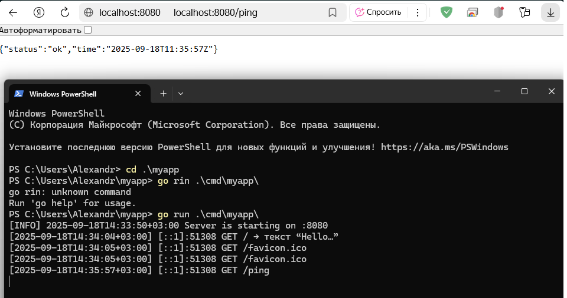

## практическа работа 2

### ЭФМО-02-25 Фомичев Александр Сергеевич

##### Структура проекта

```
myapp/
├─ cmd/myapp/main.go
├─ internal/app/app.go
├─ internal/app/handlers/ping.go  
├─ utils/logger.go
├─ utils/httpjson.go             
└─ go.mod
```

## запуск и проверка сервера 1

