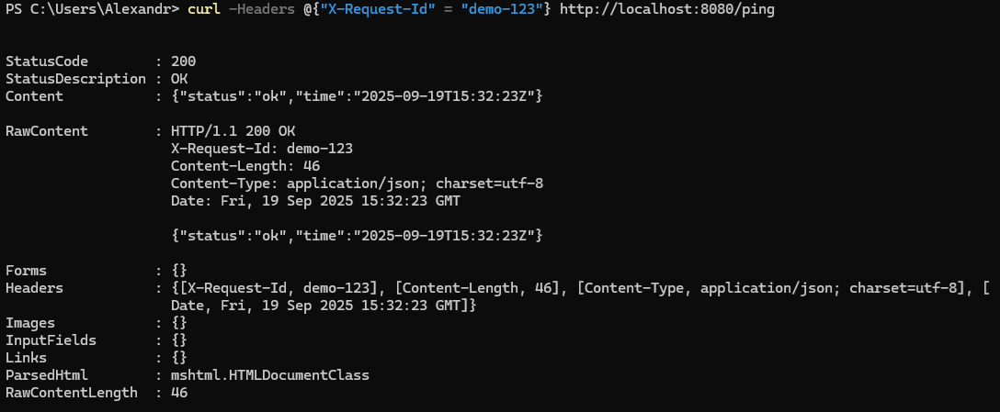

## практическа работа 2

### ЭФМО-02-25 Фомичев Александр Сергеевич

##### Структура проекта

```
myapp/
├─ cmd/myapp/main.go
├─ internal/app/app.go
├─ internal/app/handlers/ping.go  
├─ utils/logger.go
├─ utils/httpjson.go             
└─ go.mod
```

#### Цели:
-	Понять назначение ключевых директорий (cmd/, internal/, pkg/ и др.).
-	Научиться раскладывать код и артефакты проекта по «правильным» местам.
-	Собрать минимальный скелет проекта и запустить «пустой» main.go.


## запуск и проверка сервера 1


**проверка в бразере текста**


**проверка в бразере ping**


**проверка в консоле текста**


**проверка в консоле ping**

## Упр. А — Request-ID и улучшение логов


**запуск после изменений**


**проверка**

## Упр. B — Единый формат JSON-ошибок


**запуск после изменений**


**проверка**

## Упр. C — Разделение обработчиков


**конечный результат**

